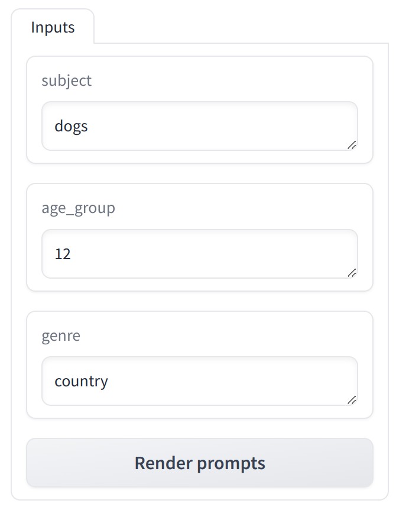

# Quickstart 2: Working with Prompts from the Command Line

In the [previous chapter](quickstart1_prompts.md), you learned how to define a prompt in Ragbits and how to use it with Large Language Models. In this guide, you will learn how to use the `ragbits` CLI to detect prompts that you have defined in your project and test them with a Large Language Model.

!!! note
    To follow this guide, ensure that you have installed the `ragbits` package and that you are in a directory with Python files that define some ragbits prompts (usually, this would be the root directory of your project) in your command line terminal. You can use code from the [previous chapter](quickstart1_prompts.md).

## Prompts Lab: GUI for Interacting with Prompts
Prompts Lab is a GUI tool that automatically detects prompts in your project and allows you to interact with them. You can use it to test your prompts with Large Language Models and see how the model responds to different prompts. Start Prompts Lab by running the following command in your terminal:

```bash
ragbits prompts lab
```

The tool will open in your default web browser. You will see a list of prompts detected in your project. To view the prompt defined in the previous chapter, select "SongPrompt" from the list.

!!! note
    By default, Prompts Lab assumes that prompts are defined in Python files with names starting with "prompt_". If you use a different naming convention, you can specify a different file name pattern using the `--file-pattern` option. For instance, if you want to search for prompts in all Python files in your project, run the following command:

    ```bash
    ragbits prompts lab --file-pattern "**/*.py"
    ```

    You can also change the default pattern for your entire project by setting the `prompt_path_pattern` configuration option in the `[tool.ragbits]` section of your `pyproject.toml` file.

The "Inputs" pane allows you to enter the values for the placeholders in the prompt. For the `SongPrompt` prompt, you can input the subject, age group, and genre of the song:

{style="max-width: 300px; display: block; margin: 0 auto;"}

Then, click "Render prompt" to view the final prompt content, with all placeholders replaced with the values you provided. To check how the Large Language Model responds to the prompt, click "Send to LLM".

!!! note
    If there is no default LLM configured for your project, Prompts Lab will use OpenAI's gpt-3.5-turbo. Ensure that the OPENAI_API_KEY environment variable is set and contains your OpenAI API key

    Alternatively, you can use your own custom LLM factory (a function that creates an instance of [ragbit's LLM class][ragbits.core.llms.LLM]) by specifying the path to the factory function using the `--llm-factory` option to the `ragbits prompts lab` command.

    <!-- TODO: link to the how-to on configuring default LLMs in pyproject.toml -->


## Conclusion
<!-- TODO: Add a link to the how-to article on using `ragbits prompts exec` -->
In this guide, you learned how to use the `ragbits` CLI to interact with prompts that you have defined in your project using the Prompts Lab tool. This tool enables you to test your prompts with Large Language Models and see how the model responds to different prompts.

<!-- ## Next Step
In the next Quickstart guide, you will learn how to use ragbit's Document Search capabilities to retrieve relevant documents for your prompts: [Quickstart 3: Adding RAG Capabilities](quickstart3_rag.md). -->